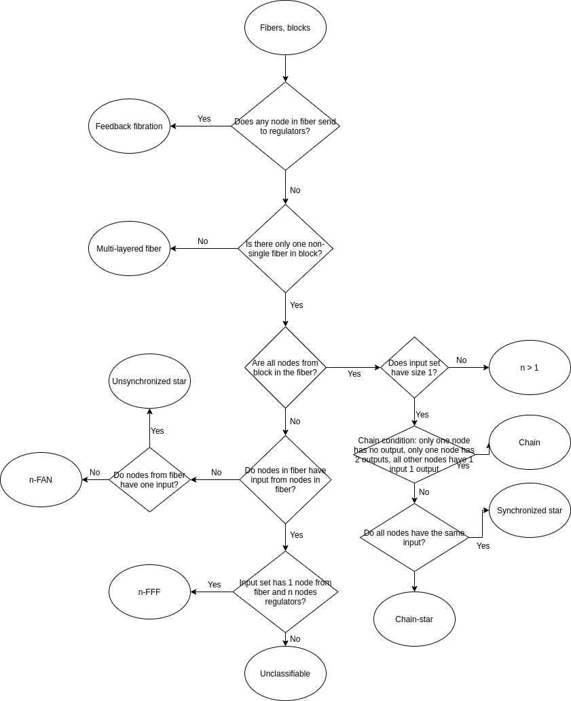

# Functions to work with fibration symmetries.

Author: **Ian Leifer, Levich Institute and Physics Department, City College of New York, New York, NY 10031**

## Installation

```r
# Install the package from the GitHub directly in RStudio by running:
devtools::install_github("ianleifer/fibrationSymmetries")
```

## Usage

### Get balanced coloring
**get.balanced.coloring.Kamei(raw_edges = NA, file = NA, sep = " ", header = F, directed = F, look.for.no.input.nodes = T)** finds the minimal balanced coloring of the graph using the algorithm introduced by Kamei and Cock. This function supports directed and undirected cases as well as weighted and unweighted cases. Directionality is defined by the variable "directed" and weightedness is defined by the number of columns in the input data (2 for undirected and 3 for directed). Input graph is specified using "raw_edges", "file", "sep" and "header" variables.

- **raw_edges** -- 2 or 3 column data frame specifying the list of edges (specify only one file or raw_edges)
- **file** -- Path to the file with the edgelist. Make sure to specify "sep" (if different from " ") and "header" (if different from FALSE) to be passed to the read.table function.
- **sep** -- To be used with the "file" variable. Defines the field separator character to be used in the read.table() function. Is set with " " by default.
- **header** -- To be used with the "file" variable. A logical value indicating whether "file" contains the names of the variables as its first line. Is set as FALSE by default.
- **directed** -- A logical value indicating whether the network is directed or not. Is set as FALSE by default.
- **look.for.no.input.nodes** -- Only valid for the directed case. Coloring is balanced if all the nodes of the same color have same ISCVs (Input Set Color Vectors as defined in ). Obvious problem with this definition is that all the nodes that have no inputs have the same ISCVs and therefore have to be the same color. This may cause a cascade effect where nodes that receive from nodes with no inputs will also have the color same to each other. There is no reason for the nodes that are assigned the same color as a result of this problem to be synchronized, because the information they receive is different. To fight this, the algorithm will force all the nodes with no inputs to have different colors at every iteration. To turn this functionality off set "look.for.no.input.nodes" as FALSE. Make sure you understand what you are doing.

**Return** -- Data frame with 2 columns: Name (for the node name) and Color (for the node color id corresponding to the minimal balanced coloring).

(1) Kamei H, Cock PJ. A. Computation of balanced equivalence relations and their lattice for a coupled cell network. SIAM J Appl Dyn Syst. 2013;12,352-382.
(2) Leifer I, Morone F, Reis SDS, Andrade JS, Sigman M, Makse HA. Circuits with broken fibration symmetries perform core logic computations in biological networks. PLoS Comput Biol 2020: 16(6): e1007776. **SI VI**.

#### Examples:
##### Directed case
```r
nodes = get.balanced.coloring.Kamei(file = "Network.txt", sep = ";", directed = T)
nodes
```

##### Undirected case
```r
graph = erdos.renyi.game(500, 350, type = "gnm")
nodes = get.balanced.coloring.Kamei(raw_edges = data.frame(as_edgelist(graph)))
nodes
```

### Get fiber building blocks

**get.building.blocks(raw_edges = NA, file = NA, sep = " ", header = F, directed = F, look.for.no.input.nodes = T)**	gets fiber building blocks classification and/or figures and raw data. Returns the list of fiber building blocks as defined in (1) that correspond to the network specified using "raw_edges", "file", "sep" and "header" variables. Classification is returned by default. Classification is obtained following the block diagram below. To get additional output specify "outputFolder" variable and "csv", "png" or "pdf" variables.

- **raw_edges** -- 2 or 3 column data frame specifying the list of edges (specify only one file or raw_edges)
- **file** -- Path to the file with the edgelist. Make sure to specify "sep" (if different from " ") and "header" (if different from FALSE) to be passed to the read.table function.
- **sep** -- To be used with the "file" variable. Defines the field separator character to be used in the read.table() function. Is set with " " by default.
- **header** -- To be used with the "file" variable. A logical value indicating whether "file" contains the names of the variables as its first line. Is set as FALSE by default.
- **outputFolder** -- Path to output csv, png or pdf files in. Will be created if doesn't exist.
- **csv** -- A logical value indicating whether building blocks node and edge csv files need to be written to the outputFolder.
- **png** -- A logical value indicating whether illustrations of the building blocks need to be outputted as png files in the outputFolder.
- **pdf** -- A logical value indicating whether the summary of the building blocks including figures, classification and node names needs to be put in the pdf file "structures.pdf" in the output folder.
- **progressBar** - A logical value indicating whether to show the progress bar.

**Return** -- A dataframe that includes:
- FiberId (the color id corresponding to the output of the get.balanced.coloring.Kamei() function),
- Nodes (list of nodes in the fiber building block),
- Fiber (list of nodes in the fiber),
- Regulators (list of regulator nodes),
- Class (Classification corresponding to the block name),
- BlockName (Block name),
- nl (|n,l> classification of the block).

(1) Morone F, Leifer I, Makse HA. Fibration symmetries uncover the building blocks of biological networks. Proc Natl Acad Sci USA. 2020;117(15):83068314.

#### Block diagram
Diagram


#### Examples:

##### Get building block classification
```r
buildingBlocks = get.building.blocks(file = "Network.txt")
buildingBlocks
```

##### Get building block classification and put the node list and the edge list in the csv format in the "buildingBlocks" folder
```r
buildingBlocks = get.building.blocks(file = "Network.txt", outputFolder = "buildingBlocks", csv = T)
buildingBlocks
```

##### Get building block classification and put the node list, the edge list in the csv format and figures in png format in the "buildingBlocks" folder
```r
buildingBlocks = get.building.blocks(file = "Network.txt", outputFolder = "buildingBlocks", csv = T, png = T)
buildingBlocks
```

##### Get building block classification and put the building block summary in the pdf format in the "buildingBlocks" folder
```r
buildingBlocks = get.building.blocks(file = "Network.txt", outputFolder = "buildingBlocks", pdf = T)
buildingBlocks
```

### Get fiber building block p-values

**get.building.block.pvalues(raw_edges = NA, file = NA, sep = " ", header = F, sampleSize = 10000, mode = c("nl", "Class", "BlockName"), method = c("degreeSequence", "erdosrenyi"), progressBar = T)** gets p-values corresponding to fiber building blocks. That is, the probability (estimated on the sample of the size "sampleSize") of having the number of building blocks in the graph (specified using "raw_edges", "file", "sep" and "header" variables) with the certain fiber numbers or belonging to the certain class or having the certain block name (depending on the "mode" variable) in the random network (with the same degree sequence or created by Erdos-Renyi depending on "method" variable).

- **raw_edges** -- 2 or 3 column data frame specifying the list of edges (specify only one file or raw_edges)
- **file** -- Path to the file with the edgelist. Make sure to specify "sep" (if different from " ") and "header" (if different from FALSE) to be passed to the read.table function.
- **sep** -- To be used with the "file" variable. Defines the field separator character to be used in the read.table() function. Is set with " " by default.
- **header** -- To be used with the "file" variable. A logical value indicating whether "file" contains the names of the variables as its first line. Is set as FALSE by default.
- **sampleSize** -- Size of the sample on which to find p-values. Default is 10000.
- **mode** -- Which p-values need to be found: nl, class or block name.
- **method** -- Randomization method: "degreeSequence" or "erdosrenyi".
- **progressBar** -- A logical value indicating whether to show the progress bar.

**Return** -- The count of building blocks in the network, their occurence in the random network and corresponding Z-Scores and p-values.

#### Examples:

##### Get p-values of |n, l> classification of the network in file "Network.txt".
```r
buildingBlockPvalues = get.building.block.pvalues(file = "Network.txt", sampleSize = 1000, mode = "nl", method = "degreeSequence")
buildingBlockPvalues
```

##### Get p-values of the fiber class (i.e. Chain, FAN fiber, Feedback Fiber, Feed-Forward Fiber etc.) of the network in file "Network.txt" randomizing using Erdos-Renyi model with the same number of nodes and edges.
```r
buildingBlockPvalues = get.building.block.pvalues(file = "Network.txt", sampleSize = 1000, mode = "Class", method = "erdosrenyi")
buildingBlockPvalues
```

### Get ISCV (Input Set Color Vector)
**get.input.set.color.vector(nodes, raw_edges = NA, file = NA, sep = " ", header = F, directed = F)** finds the ISCV (Input Set Color Vector as defined in (1)) of all nodes in the graph given the coloring. Coloring is specified by "nodes" variable formatted as the output of the get.balanced.coloring.Kamei() function. Input graph is specified using "raw_edges", "file", "sep" and "header" variables. **Note, works for both directed and undirected networks.**

#' @param nodes Variable is formatted as the output of the get.balanced.coloring.Kamei() function. Dataframe with 2 columns: Name, Color.
- **raw_edges** -- 2 or 3 column data frame specifying the list of edges (specify only one file or raw_edges)
- **file** -- Path to the file with the edgelist. Make sure to specify "sep" (if different from " ") and "header" (if different from FALSE) to be passed to the read.table function.
- **sep** -- To be used with the "file" variable. Defines the field separator character to be used in the read.table() function. Is set with " " by default.
- **header** -- To be used with the "file" variable. A logical value indicating whether "file" contains the names of the variables as its first line. Is set as FALSE by default.
- **directed** -- A logical value indicating whether the network is directed or not. Is set as FALSE by default.

**Return** --  A dataframe each column of which is an ISCV of each node of the graph.

(1) Leifer I, Morone F, Reis SDS, Andrade JS, Sigman M, Makse HA. Circuits with broken fibration symmetries perform core logic computations in biological networks. PLoS Comput Biol 2020;16(6):e1007776. **SI VI**

#### Examples:

##### Get the ISCV that was used on the last step of coloring of the network in file "Network.txt".
```r
nodes = get.balanced.coloring.Kamei(file = "Network.txt", directed = T)
ISCVs = get.input.set.color.vector(nodes = nodes, file = file, directed = T)
ISCVs
```

## License

This project is licensed under the MIT License - see the [LICENSE.md](LICENSE.md) file for details
